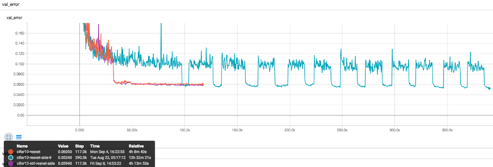

<!--ts-->
Table of Contents
=================
   * [ε-ResNet](#ε-resnet)
   * [Installation](#installation)
   * [Datasets](#Datasets)
   * [Training](#training)
   	   * [On ImageNet](#on-imagenet)
      * [On other datasets](#on-other-datasets)
   * [Testing](#testing)
      * [Compressing model](#compressing-model)
      * [Testing compressed model](#testing-compressed-model)
      
   * [Implementation](#implementation)
   * [Citing ε-ResNet](#citing-ε-resnet)

<!-- Added by: xiny, at:  -->

<!--te-->
# &epsilon;-ResNet
[&epsilon;-ResNet](https://arxiv.org/abs/1804.01661) is a variant of ResNet to automatically discard redundant layers, which produces responses that are smaller than a threshold &epsilon;, with a marginal or no loss in performance.


# Installation

Dependencies is the same as [tensorpack](https://github.com/ppwwyyxx/tensorpack):

+ Python 2.7 or 3
+ Python bindings for OpenCV (Optional)
+ TensorFlow >= 1.3.0

```
# install git, then:
# pull tensorpack
git clone https://github.com/ppwwyyxx/tensorpack.git
# This implementation is based on tags/0.2.0. I noticed that some APIs in the latest tensorpack is changed, I'll make it compatible in the future version.  
git checkout tags/0.2.0

# pull epsilon-ResNet
https://github.com/yuxwind/epsilonResnet.git

cp LearningRateSetter.py {tensorpack_root}/tensorpack/callbacks/
cd epsilonResnet/scripts
```
	 
# Datasets

&epsilon;-ResNet is tested on four datasets: CIFAR-10, CIFAR100, SVHN, ImageNet. 

If you would like to compare with our experiments in your research, please run the following scripts directly.

+ run_cifar10.sh
+ run_cifar100.sh
+ run_imagenet.sh
+ run_svhn.sh

A few trained and compressed models on CIFAR-10 and ImageNet are provided [here](https://drive.google.com/drive/folders/1pJ6C3IbxmrvwjgTlnlQ13bLZXuH3j8yt?usp=sharing)

# Training

### On ImageNet
Here is an example of training on ImageNet with two variants of ResNet 101: Pre-activation ResNet(the standard one) and &epsilon;-ResNet.

Two &epsilon; values 2.0 and 2.1 give out 20.12% and 25.60% compression ratio separately.

<p style="text-align:center;"></p>

Usage:

```
python imagenetEpsilonResnet.py -d 101 -e 2.0 --gpu 0,1,2,3 --data {path_to_ilsvrc12_data}  
```


### On other datasets
Here is an example of training on CIFAR-10 with ResNet-110:

+ Pre-activation ResNet(the orange line)
+ Pre-activation ResNet + side supervision(the purple line)
+ &epsilon;-ResNet(the blue line， &epsilon;=2.5)
	



Their learning rates are as below. The two baselines adopt the same learning rate policy. 


Usage:

```
python cifarEpsilonResnet.py -n 18 -e 2.5 --gpu 1 -o cifar10-e_2.5-n_18 
```
Note: The usage of training CIFAR100, SVHN are similar. Please refer to their scripts for examples.

# Testing
### Compressing model
We do testing on an standard ResNet after discarding the redundant layers. 

Usage:

```
python compressModel.py --dir models/cifar10-e_2.5-n_125 --step 303420

```

Parameters:

```
 --dir:  specifies the train_log file directory. Three files are required. They are for this example
 	log.log
 	model-303420.data-00000-of-00001
 	model-303420.index
 --step:  specifies the model of which step is to be compressed.
```

It will generate compressed model files:

```
compressed_model_303420.cfg.
compressed_model_303420.data-00000-of-00001
compressed_model_303420.index
```

### Testing compressed model
Here is an example to test on CIFAR-10 dataset. The script cifarCompressedResnet.py builds a standard ResNet. It reads '*.cfg' file to get the structure of the compressed model.

Usage:

``` 
python cifarCompressedResnet.py --cfg models/cifar10-n_125/compressed_model_303420.cfg --gpu 0 --cifar10 
```


<!---
Or we prune a block if the moving average value is greater than a threshold. That's is discarded\_threshold in compressModel.py.

On a ImangeNet model of &epsilon;-ResNet 101, we test different discarded\_treshold and get results as below. 

[//]: # (|  discarded\_treshold | 0.5   |  1 | 0.3  |)
[//]: # (|---|---|---|---|)
[//]: # (| val\_error\_top1  	|0.23036 |  0.23182 |  0.23448  | )
[//]: # (| val\_error\_top5  	|0.06694 |  0.06744 |  0.0694   |  )
[//]: # (| #discarded block  |7   	  |  6|  8 |  ) 
-->


## Implementation
Please refer to [here](scripts/README.md) for more details of implementation. 
## Citing &epsilon;-ResNet

Please cite &epsilon;-ResNet in your publication if it helps your research:

```
@InProceedings{Yu_2018_CVPR,
author = {Yu, Xin and Yu, Zhiding and Ramalingam, Srikumar},
title = {Learning Strict Identity Mappings in Deep Residual Networks},
booktitle = {The IEEE Conference on Computer Vision and Pattern Recognition (CVPR)},
month = {June},
year = {2018}
}
```
